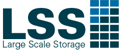
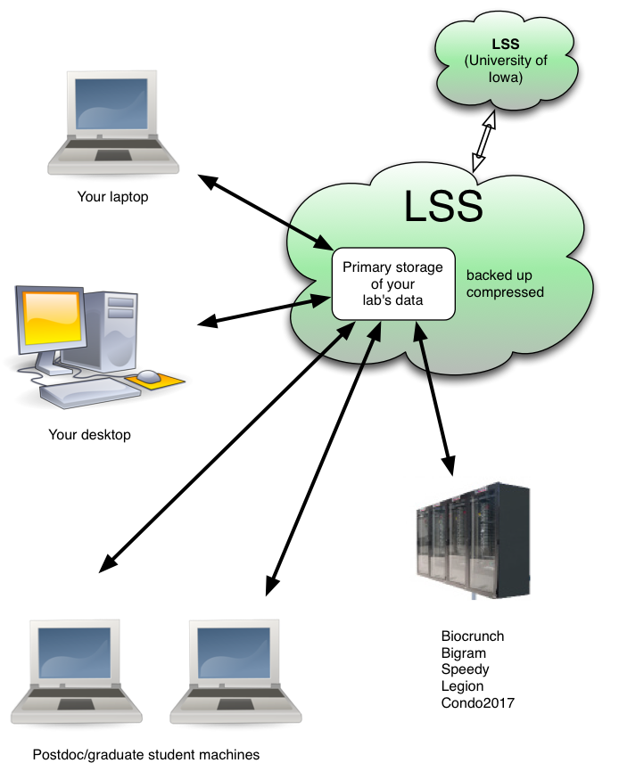

# Large Scale Storage (LSS)

### Overview

Large Scale Storage (LSS) is a research file storage service for faculty and staff. LSS is a software defined storage solution, and contains approximately **3 petabytes of usable storage**, with the ability to continue to grow.

LSS has been designed to provide an extremely low cost, reliable solution for storing large quantities of research data.  The primary user audience for this system is research labs who need to store terabytes of data for long periods of time.  LSS is useful for backups, archiving, and storing large files (e.g., videos, sequencing data, images, etc.) The system is not meant for holding data related to administrative business, supporting critical business processes, or providing backing storage for web applications or virtual machines.  Support for the service is available Mon-Fri during normal working hours by opening a ticket with [lss-help@iastate.edu](mailto:lss-help@iastate.edu).

LSS storage costs just **$40 per terabyte per year**, and can be paid for by individual researchers or groups, or can be subsidized by a college or department.  Please visit [https://lss.apps.it.iastate.edu](https://lss.apps.it.iastate.edu)/ to request space. Instructions on how to use the site are available [here](request_space.md).

LSS can be accessed from Windows, Mac, and Linux computers without having to install any additional software (off-campus access requires use of the Iowa State [VPN](https://iastate.service-now.com/it?id=kb_article&sysparm_article=KB0011105)). Instructions on how to access LSS can be found [here](mount_folders.md).
### Features

*   **Redundancy:** Data is stored redundantly across disks within each server.  Within each of the server nodes, protection is provided for two disk failures, and software protects against silent data corruption.
*   **Reliable Uptime:**  The full system will be taken offline approx. 1-2 times per semester for system maintenance such as security patching. This will be coordinated with the research groups as each server is taken offline.
*   **Snapshots:** We take hourly, daily, weekly, and monthly snapshots. This provides some protection against errors such as accidental deletion or modification of a file.
*   **Secure:** The LSS system is managed by experienced IT professionals from across several IT units including central University IT and the colleges.  The system has undergone an information security review, is kept current with relevant patches, and secured against unauthorized access.  Users must be on the Iowa State network or connected via VPN to access their folders.  Access is granted to NetID's via group membership. 
*   **Disaster Recovery:**  All of the data is mirrored to servers at the [ITF data center](https://its.uiowa.edu/researchdatacenter) at the University of Iowa. This system is not available as a hot failover, but data can be retrieved in the event of a catastrophic failure, act of nature, etc. that may impact the LSS system at Iowa State.
*   **Compression:** Data on LSS is compressed, meaning that if your data is compressible it will take up less space than when stored by traditional means. LSS compresses data inline, so there is no need to zip files when storing them on LSS.

### Use Cases

Below are a few examples of the types of situations where LSS would be a good solution.  This list is not exhaustive, but can provide some insight into when to use LSS vs other storage solutions such as [CyBox](https://iastate.service-now.com/it?id=kb_article_view&sysparm_article=KB0011120).

> I perform research in the biological sciences, and need somewhere to store large amounts of data that I've received from a sequencing facility.  I often need to analyze this data on high performance servers or clusters, and also need my lab members to have access the the raw data and the output from our jobs. I can use LSS as the permanent storage location for my critical research data.  When I need to run an analysis, I will copy the data to the local storage of the server I'm working on, and then copy the results back to LSS when I'm done.

> My research involves large quantities of photos or videos.  I often need to perform some analysis on this media on my computer, or use the files to produce edited output content. I can keep my files on LSS, and copy them to my computer for editing and analysis, and copy the final product back to LSS when I'm done. 

> I do a lot of field work, capturing data from observations, sensors, etc. I primarily work with the summarized analysis of this data, but I need to keep the raw data around for a long period of time in case I need to refer to it again.  I keep my raw data in LSS, but I store my associated spreadsheets, manuscripts, etc. in my [CyBox](https://it.las.iastate.edu/cybox-cloud-storage) folder where I'll do the majority of my day to day work.

Please email [researchit@iastate.edu](mailto:researchit@iastate.edu) with general questions, or [lss-help@iastate.edu](mailto:lss-help@iastate.edu) to open a ticket related to LSS storage.

