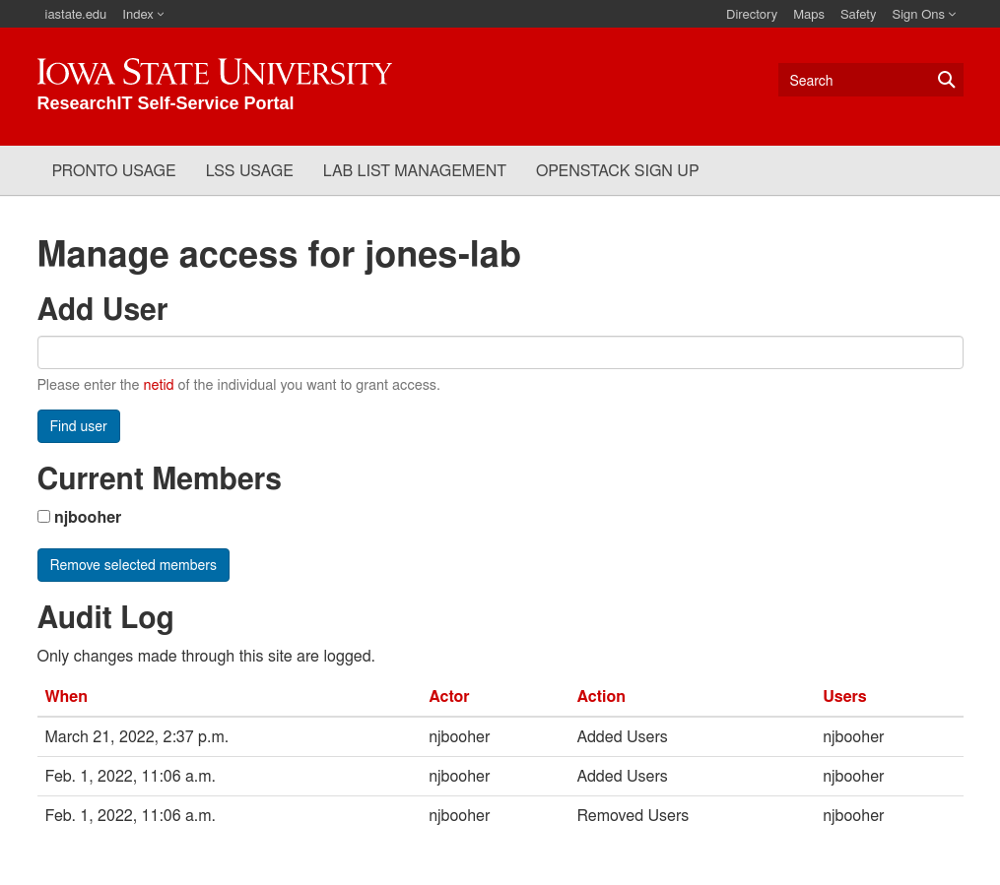

# Manage Access

PIs can manage access to their LSS share through the ResearchIT Self Service portal.

This function is currently only available for shares with names that end in `-lab`.

## How to Access
[https://diy.las.iastate.edu/listman/manage/](https://diy.las.iastate.edu/listman/manage/)

This site is only accessible from an on-campus internet connection or through the [VPN](https://iastate.service-now.com/it?id=kb_article&sysparm_article=KB0011105).

## Tutorial

The access management page looks like this:

### Add a user

Enter the net ID of the user you want to add and click 'Find User'. A confirmation page will be shown. Click 'Yes, I really want to add this user to my lab list'.

[Pronto](https://researchit.las.iastate.edu/guides/pronto/) users please note that adding a someone to your LSS list will also grant them access to your Pronto /work directory.

### Remove a user

Check the box next to the user's name, and click 'Remove selected members'.

### Audit log

This lists any changes made to the list through the website after February 1, 2022. If you requested a change via email it may not be reflected here.