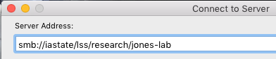
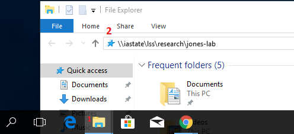
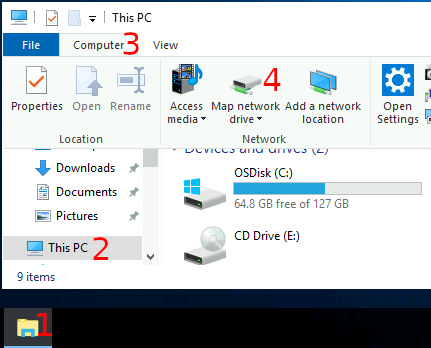
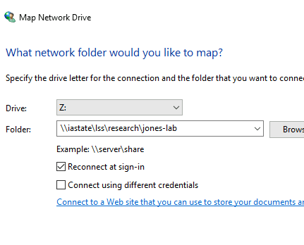

# How to Mount Folders from LSS

We will discuss mounting the LSS systems from the following system types:

*   Mac OS X
*   Windows
*   Research IT and/or Biology IT Linux Servers
*   Nova Research Cluster
*   Linux GUI Desktop (Gnome)

The following examples will use the values:

*   _jones_, as your P.I.'s Net-ID, and
*   _you_, as your ISU Net-ID.

This means you will need to substitute your PI's Net-ID for _jones_ and your NetID for _you_. The naming convention for all LSS research folders is based on the Net-ID of your PI and has the format _netid-lab_. Thus, our example LSS folder is called _jones-lab_.

If you have problems, please contact your local departmental IT support technician, or email [lss-help@iastate.edu](mailto:lss-help@iastate.edu?subject=LSS%20Mapping%20help)

## Mounting from Mac OS X

*   From the Finder application menu item "Go" select "Connect to Server"
*   Enter smb://iastate/lss/research/_jones-lab_ as shown here:



​If a login prompt is received:

* Enter IASTATE\\_you_ in the username field.
* Enter your Net-ID password in the password field.

Mac OS X likes to write [small metadata files named .ds\_store](https://en.wikipedia.org/wiki/.DS_Store) to every filesystem it encounters. These files are used to store things like icon position in the Finder. The writing of these files can slow down your experience with LSS significantly, and we recommend that you tell your computer to not write these files to network drives by issuing the following command in Terminal:

```bash
defaults write com.apple.desktopservices DSDontWriteNetworkStores -bool true
```

You only need to do this once on your computer.

## Mounting from Windows

### As a Folder (use this if you're unsure)

1. [Open a File Explorer window](https://support.microsoft.com/en-us/help/4026617/windows-10-windows-explorer-has-a-new-name)
1. Type this: `\\iastate\lss\research\jones-lab`



If a login prompt is received:
* Enter IASTATE\\_you_ in the username field.
* Enter your Net-ID password in the password field.

### As a Network Drive

1. [Open a File Explorer window](https://support.microsoft.com/en-us/help/4026617/windows-10-windows-explorer-has-a-new-name)
1. Click 'This PC'
1. Click the 'Computer' tab.
1. Click 'Map Network Drive'.  
    
1. In the 'Folder' box, type this: `\\iastate\lss\research\jones-lab`  
    
1. Click button labeled 'Finish'.

## Mounting from Pronto

LSS folders are mounted on the pronto data transfer node (prontodtn.las.iastate.edu) E.g. if the netid of your PI is _jones_, the path is /lss/research/jones-lab

To use your LSS data for pronto jobs, you should use the data transfer node to copy files from your /lss directory to your /work directory, and then run jobs against the data in your /work directory. 

## Mounting from Nova cluster

*   Login to the nova cluster head node using the [regular procedure](https://www.hpc.iastate.edu/guides/nova/access-and-login).
*   Use ssh to access novadtn from the Nova cluster head node.
*   Navigate to your research folder, which is under /lss/research.
    *   Remember that the folder is named for your PI's Net-ID (_netid-lab)_
    *   You should always copy files from this location into /work/LAS as needed to run your jobs. Results should be copied back to your research folder when finished.

```bash
ssh novadtn
cd /lss/research/netid-lab
```

## Mounting From Linux GUI

1.  Choose "Windows Share" from the Type dropdown.
2.  Connection Information:
    *   **Server:** las-dfs-01.las.iastate.edu
    *   **Share:** lss
    *   **Folder:** research/jones-lab.

*   First, open the Files application and choose the "Connect to Server" option in the left-hand access bar.
*   In the "Connect to Server" dialog box,
    *   The connection string is in the format `smb://<server>/<share>/<folder>`.
        *   Using our example values, the connection string would be smb://las-dfs-01.las.iastate.edu/lss/research/jones-lab
    *   Click the "Connect" button
*   In the authorization box, type in your ISU Net-ID, Domain, and Password.
    *   **Domain:** IASTATE
    *   **Username:** _you_
    *   **Password:** _your-password_

## Mounting over VPN or from a personally owned device

The default address will not work over [VPN](https://iastate.service-now.com/it?id=kb_article&sysparm_article=KB0011105), or from personally owned or non-domain joined devices.  If you are mounting LSS in one of these situations, use this address:

**MacOS** `smb://las-dfs-01.las.iastate.edu/lss/research/jones-lab`

**Windows** `\\las-dfs-01.las.iastate.edu\lss\research\jones-lab`

Instead of:

**MacOS** `smb://iastate/lss/research/jones-lab`

**Windows** `\\iastate\lss\research\jones-lab`

The other steps for your operating system remain the same as listed above.

## Regarding Permissions

Permissions to the shared folders are controlled on the server back-end and may not display correctly on your client. This has no impact no the enforcement of permissions. Your files are only accessible by people in the group that you have authorized.