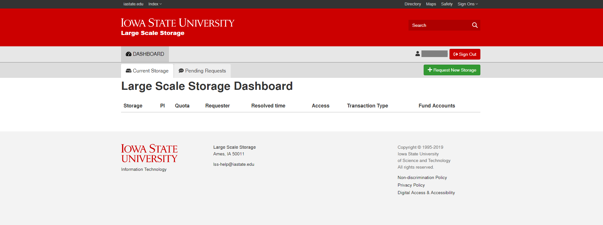
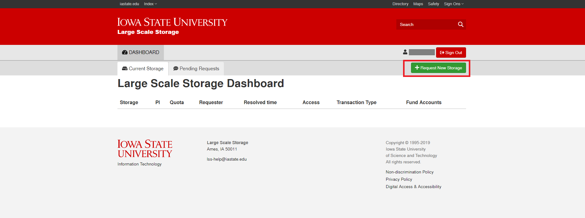
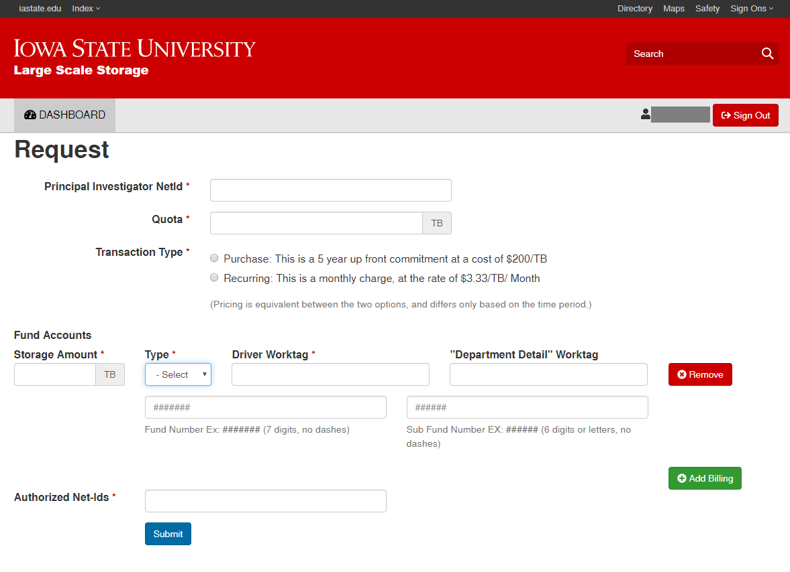
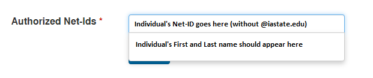
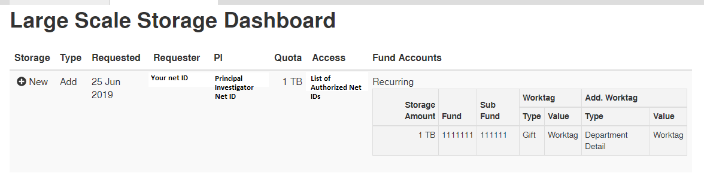

# Request Space

## How to Access
You can request space on the LSS here:

[https://lss.apps.it.iastate.edu/](https://lss.apps.it.iastate.edu/)

## Tutorial
You will be redirected to this page:

Click on _Request New Storage._

You will be redirected to this page. 

By default, the _Principal Investigator NetId_ field should be autofilled with your Net ID. Fill out the rest of the necessary fields.

Please note that the _Authorized Net-IDs_ field refers only to individuals allowed to manage the billing for this share, within this portal. To manage users who have access to files within the share, please see the [Manage Access](manage_access.md) article. 

Be sure to omit the '@iastate.edu' portion of the authorized individual's net ID. You can enter in more than one Net-ID. 

Once complete, click _Submit_.

Under the _Pending Requests_ tab, your request should now appear on the LSS dashboard. 

You you will receive an email notificaiton when your request is processed.