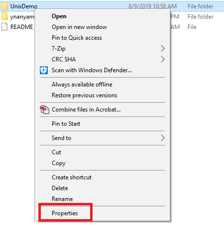
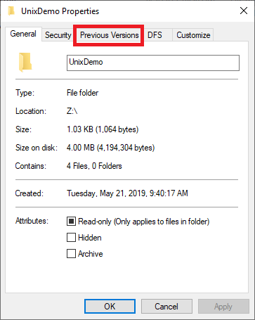
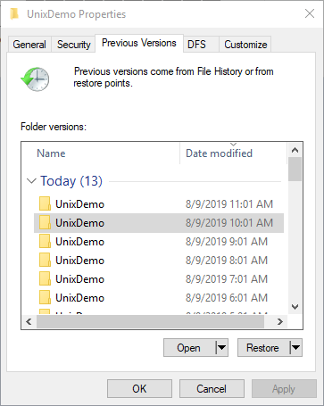
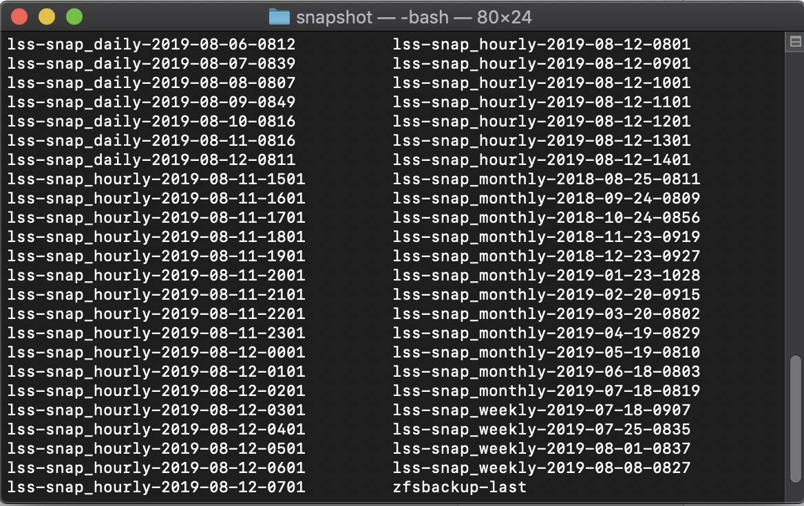

# Snapshots

Snapshots refer to the state of your storage space at a certain point in time and are "free" until files that were present at that point in time are changed or deleted. In order for files referred to by snapshots to be available after they're deleted they still have to be present on your storage, meaning that if you delete a file, it is not actually deleted until after the snapshot is deleted and as such still consumes space.

## Access Snapshots

### Windows

On Windows, start by navigating to the **File Explorer**. Navigate to your mounted drive. You can right click on the desired file/folder you would like to recover an older version of. Click **_Properties_**.



A window like this will appear. Click on the _**Previous Versions**_ tab.



You will see a window like this:



This will give you all the previous versions of the folder/file you selected with a timestamp. 

Clicking on _**Open**_ will simply let you view/copy the contents of the selected folder.

Please note that you can **not** use the _**Restore**_ button to revert your folders.

### Mac OS X/Linux

On Mac OS X/Linux, you can access a hidden folder that contains GMT date-time stamped folders. You can navigate through the list of folders to retrieve the files you want.

First you will need to navigate to your mounted LSS via the terminal. Next, you can navigate to the snapshot directory via the command below: 

```bash
cd .zfs/snapshot
```

You will see a list of folders with timestamps. When you navigate into one of them, all of your files in your LSS on that date will be available to you.



## Purging Snapshots

if you want to reclaim space after deleting files you'll need to email lss-help@iastate.edu or researchit@iastate.edu and ask us to delete snapshots for you, or wait until the snapshots rotate out automatically. Before asking for snapshot deletion you should make sure that you will no longer need any of the data that may have been deleted after those snapshots were created as it will be unrecoverable.
