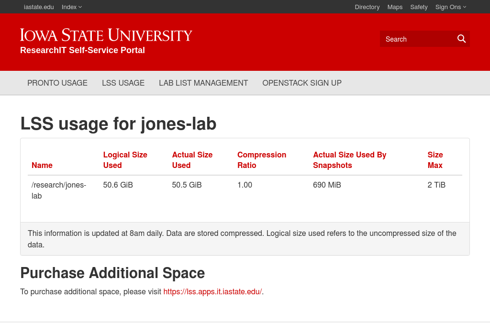
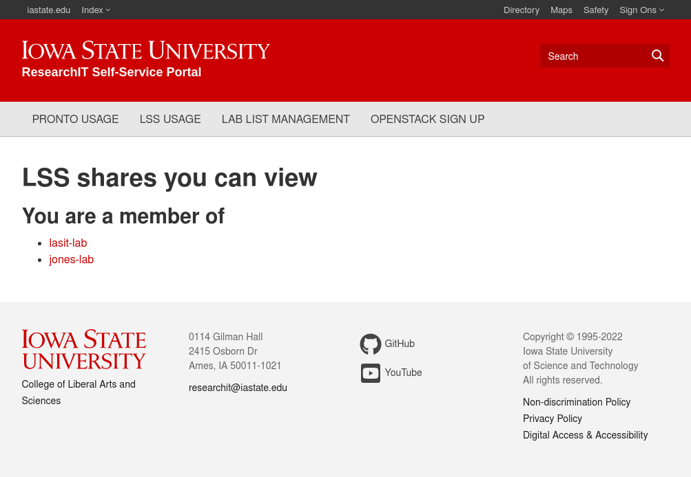

# Usage Information

Lab members can see how much free space their lab's LSS share has available through the ResearchIT Self Service portal.

This function is currently only available for shares with names that end in `-lab`.

# How to Access

[https://diy.las.iastate.edu/lss/usage/](https://diy.las.iastate.edu/lss/usage/)

This site is only accessible from an on-campus internet connection or through the [VPN](https://iastate.service-now.com/it?id=kb_article&sysparm_article=KB0011105).

## Tutorial
Users who are only a member of one lab will be redirected to the page for that lab.

If you are a member of multiple labs, you will see a list of those labs. Click one of the links to proceed to the usage information page.

